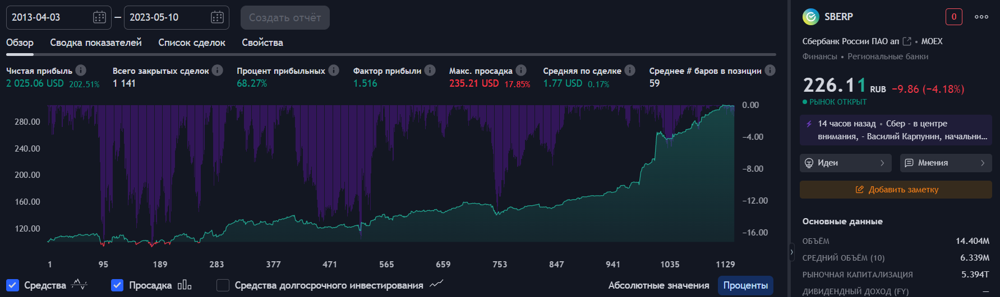

# FinHookMaster

FinHookMaster - это инструмент, который обеспечивает  связь между TradingView и брокером Финам с использованием хуков. Он позволяет пользователям автоматизировать процесс торговли, получая сигналы о купле или продаже прямо из TradingView и автоматически отправляя их в Финам с учетом Тейк-профита и Стоп-лосса.

## Использование открытых данных

FinHookMaster использует открытые данные, предоставляемые TradingView, включая множество стратегий и индикаторов, доступных на платформе. Это предоставляет пользователям возможность выбора из тысяч различных стратегий для автоматической торговли. Ниже приведены некоторые примеры стратегий и индикаторов, которые можно использовать:

- [Moving Average Crossover Strategy](https://ru.tradingview.com/v/Ip667jzb/)
- [RSI Divergence Indicator](https://ru.tradingview.com/v/7mYAGmYK/)
- [MACD Strategy](https://ru.tradingview.com/v/DushajXt/)

Пожалуйста, обратите внимание, что каждый пользователь должен провести собственный анализ и выбрать стратегию, которая наилучшим образом соответствует его потребностям и рискам. 

Вот пример моей стратегии, которую я разработал и настроил:


## Установка

Для начала вам необходимо установить все необходимые зависимости. Это можно сделать с помощью следующей команды:

```
pip install -r requirements.txt
```

## Использование

Проект включает два основных файла: `main.py` и `main_bot.py`.

- `main_bot.py` запускает телеграм-бота, который служит для управления веб-хуками. Через телеграм-бота вы можете добавлять, удалять и просматривать веб-хуки. Для начала работы запустите этот файл и настройте свои веб-хуки с помощью команд `/add`, `/rem` и `/list`.

- `main.py` слушает входящие веб-хуки и обрабатывает их, открывая ордера в соответствии с полученными данными. Он также отправляет информацию о полученных веб-хуках в телеграм-канал. Этот файл следует запускать после настройки веб-хуков через телеграм-бота.

Важно помнить, что оба файла должны быть запущены сразу после настройки для корректной работы системы. Для этого вы можете использовать менеджер процессов, такой как Supervisor или PM2, который будет следить за выполнением этих процессов и автоматически перезапускать их в случае их остановки.
## Локальная проверка

Вы можете проверить работу веб-хука локально с помощью инструмента командной строки HTTPie. Установите его с помощью команды `pip install httpie`, а затем отправьте тестовый запрос следующим образом:

```
http POST localhost:8000/webhook unique_token=token position=buy current_price=60 security_board="TQBR"```
```

Это приведет к отправке тестового уведомления о сигнале на ваш бот,  а так же откроет ордер на бирже .


## Конфигурация

В проекте используется файл конфигурации `config.py`, в котором указаны следующие переменные:

- `TELEGRAM_API_TOKEN`: Это токен вашего телеграм-бота. Вы можете получить его, создав нового бота через BotFather в Телеграме. Больше информации о том, как создать бота и получить API-токен, можно найти в [официальной документации](https://core.telegram.org/bots#6-botfather).

- `FINAM_API_TOKEN`: Это ваш токен для API Финам. Вы можете получить его в личном кабинете на сайте [сomon.ru](https://www.comon.ru/). После авторизации перейдите в раздел "Настройки" и затем в подраздел "API-токены". Создайте новый токен и скопируйте его.

- `CHAT_ID`: Это идентификатор вашего чата в Телеграме. Для его получения напишите в любой чат, где участвует ваш бот, сообщение `/my_id`. В ответ на это сообщение бот должен отправить вам идентификатор этого чата.

- `CLIENT_ID`: Это номер вашего счета в Финам. Вы можете найти его в договоре с брокером или в личном кабинете на сайте [сomon.ru](https://www.comon.ru/).

- `FINAM_API_BASE_URL`: Это базовый URL для API Финам. Обычно его не нужно менять.

- `IP_SERVER`: Это IP-адрес вашего сервера, на котором будет работать система. Если система работает на локальной машине, укажите "localhost".

Не забудьте заменить все эти значения на ваши собственные данные перед запуском проекта.

## Как получить TELEGRAMM_API_TOKEN и CHAT_ID

1. **Создание бота в Телеграме и получение токена API**
    - Найдите в Телеграме аккаунт @BotFather и начните с ним диалог.
    - Нажмите на кнопку "Start" или напишите команду /start.
    - Для создания нового бота используйте команду /newbot и следуйте инструкциям. BotFather попросит вас выбрать имя для вашего бота и затем имя пользователя (username), которое должно оканчиваться на 'bot' (например, FinamHookbot).
    - После создания бота, BotFather предоставит вам токен API. Этот токен будет использоваться для аутентификации вашего бота и отправки запросов к API Телеграма. Сохраните его, он вам понадобится в конфигурационном файле.

2. **Получение chat_id**
    - Для получения chat_id вы можете использовать специализированного бота в Телеграме. Один из таких ботов - это @getmyid_bot.
    - Найдите в Телеграме аккаунт @getmyid_bot и начните с ним диалог.
    - Нажмите на кнопку "Start" или напишите команду /start. Бот автоматически отправит вам ваш chat_id.
    - Сохраните полученный chat_id, он вам понадобится в конфигурационном файле.

Помните, что chat_id и TELEGRAMM_API_TOKEN - это конфиденциальная информация, и её не следует делиться с другими и публиковать в открытом доступе.

3. **Подключение бота**
    - В коде вашего проекта в файле `config.py` (или другом подходящем файле) установите значения `TELEGRAM_API_TOKEN` и `CHAT_ID` на полученные ранее токен и chat_id.
    - В этом же файле установите значение `FINAM_API_TOKEN` на токен, полученный из личного кабинета Финам.
    - Теперь вы можете запустить бота, выполнив в консоли команду `python main_bot.py` (или любую другую команду, которую вы используете для запуска бота).

Помните, что токены и ID - это конфиденциальная информация, их не следует делиться с другими и публиковать в открытом доступе.

## Структура проекта

Проект организован следующим образом:

- Корневая директория содержит основные файлы проекта, включая README.md и requirements.txt.
- В папке `Telegram` находятся файлы, отвечающие за работу телеграм-бота.
- В папке `Finam` находятся файлы, отвечающие за взаимодействие с API Финам.
- В папке `Database` находятся файлы, отвечающие за работу с базой данных.
- В папке `Hook` находятся файлы, отвечающие за обработку веб-хуков.

## Лицензия

Этот проект лицензирован под лицензией Apache 2.0. Подробности можно найти в файле LICENSE.

## Контакты

Если у вас есть вопросы или предложения, связанные с этим проектом, не стесняйтесь обращаться.
